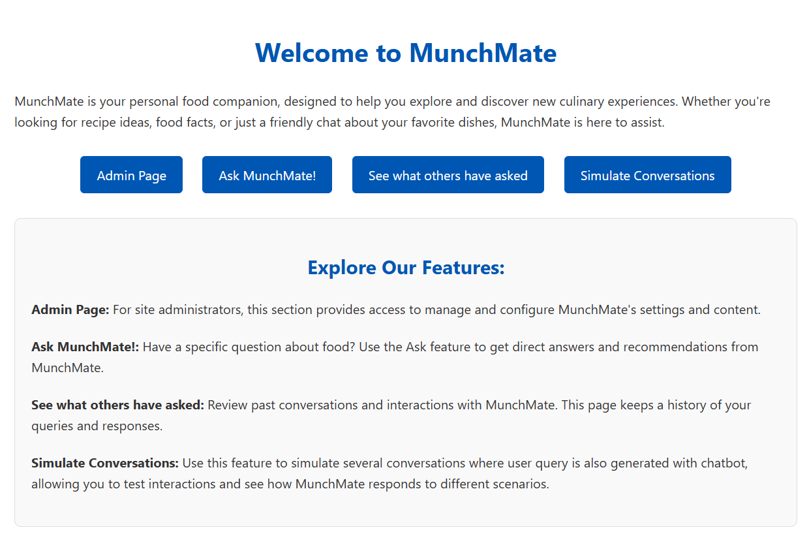
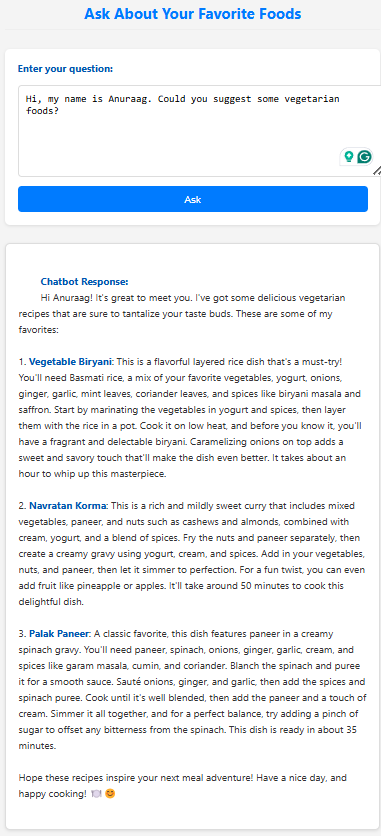

# MunchMate - Your Culinary AI Companion
## live version: http://18.157.168.212:8000/
MunchMate is a web application designed to be your go-to culinary assistant. It integrates an LLM service (powered by OpenAI/ChatGPT) with a recipe database to provide intelligent food recommendations and conversational experiences.

## What MunchMate Does

* **Intelligent Food Recommendations:** MunchMate can answer your food-related questions and provide recipe suggestions based on your preferences.
* **Conversational AI:** Engage in natural language conversations with MunchMate to explore culinary ideas.
* **Recipe Database:** MunchMate has access to a database of recipes, allowing it to provide tailored suggestions.
* **Contextual Answers:** MunchMate will attempt to conform its answers around randomly picking top 3 foods from a category of 3 types (vegan, vegetarian, non-veg) based on user query.

## Key Features

* **Chatbot (LLM Service):** Uses OpenAI/ChatGPT to understand and respond to user queries.
* **Recipe Management:** Stores and retrieves recipes from a MySQL database.
* **Web UI:** Provides a user-friendly interface for interacting with the chatbot and exploring recipes.
* **API Endpoints:** Offers API endpoints for programmatic access to the chatbot and recipe services.
* 

## Getting Started

### Prerequisites

* Docker (recommended) or Python 3.x with pip
* Docker Compose (if using Docker)
* An OpenAI API key

### Setup - Docker (Recommended)

1.  **Clone the Repository:**
    ```bash
    git clone <repository_url>
    cd munchmate
    ```
2.  **Build and Run the Containers:**
    ```bash
    docker-compose up -d --build
    ```
    * **Note:** On newer Docker Compose setups, ensure that the web application and MySQL database containers are on the same network. If needed, manually connect the web container to the network:
        ```bash
        sudo docker network connect munchmate_default munchmate-web-1
        ```
3.  **Run Migrations and Create Superuser:**
    ```bash
    docker exec -it <django-container-id> python manage.py migrate
    docker exec -it <django-container-id> python manage.py createsuperuser
    ```
    * Replace `<django-container-id>` with the ID of your Django container.
4.  **Configure OpenAI API Key:**
    * Open `chatbot/views.py` and set your OpenAI API key in the `openai.api_key` variable.
5.  **Access the Application:**
    * Open your web browser and navigate to `http://localhost:8000`.

### Setup - Standalone (Without Docker)

1.  **Clone the Repository:**
    ```bash
    git clone <repository_url>
    cd munchmate
    ```
2.  **Create a Virtual Environment (Recommended):**
    ```bash
    python3 -m venv venv
    source venv/bin/activate  # On Linux/macOS
    venv\Scripts\activate  # On Windows
    ```
3.  **Install Dependencies:**
    ```bash
    pip install -r requirements.txt
    ```
4.  **Set up Database:**
    * Install MySQL and create a database named `munchmate_db`.
    * Update the database settings in `munchmate/settings.py`.
5.  **Run Migrations:**
    ```bash
    python manage.py migrate
    ```
6.  **Create Superuser:**
    ```bash
    python manage.py createsuperuser
    ```
7.  **Configure OpenAI API Key:**
    * Open `chatbot/views.py` and set your OpenAI API key in the `openai.api_key` variable.
8.  **Run the Development Server:**
    ```bash
    python manage.py runserver
    ```
9.  **Access the Application:**
    * Open your web browser and navigate to `http://localhost:8000`.

### Standalone Docker Commands

* Build the Docker image:
    ```bash
    docker build -t munchmate-app .
    ```
* Run a standalone MySQL container:
    ```bash
    docker run --name mysql-db -e MYSQL_ROOT_PASSWORD=rootpass -e MYSQL_DATABASE=munchmate_db -e MYSQL_USER=munchuser -e MYSQL_PASSWORD=munchpass -p 3306:3306 -d mysql:latest
    ```
* Run a basic mysql container for root user only.
    ```bash
    docker run --name some-mysql -e MYSQL_ROOT_PASSWORD=your_root_password -p 3306:3306 -d mysql:latest
    ```
* Preload the recipe table:
    ```bash
    docker cp recipes_preloaded.sql mysql-db:/tmp/recipes_preloaded.sql
    docker exec -it mysql-db bash -c "mysql -u root -p'rootpass' munchmate_db < /tmp/recipes_preloaded.sql"
    ```
* Access the MySQL container's shell:
    ```bash
    docker exec -it mysql-db mysql -u root -p"rootpass"
    ```

### Ubuntu Setup

* Install Docker:
    ```bash
    sudo apt update
    sudo apt install -y docker.io
    sudo systemctl enable --now docker
    ```

### Simulate API Endpoint (Browser Console)

* Trigger the `simulate` API endpoint from your browser's console:
    ```javascript
    fetch("/api/simulate/", {
        method: "POST",
        headers: { "Content-Type": "application/json" },
        body: JSON.stringify({ count: 5 })
    })
    .then(response => response.json())
    .then(data => console.log("Success:", data))
    .catch(error => console.error("Error:", error));
    ```

## Possible Improvements

* **User Accounts:** Implement user registration and authentication.
* **Enhanced Recipe Database:** Allow users to add and manage recipes.
* **Advanced Authentication and Security:** Implement robust authentication mechanisms and TLS/SSL encryption.
* **Expand LLM Capabilities:** Provide the LLM service with access to more diverse and updated recipe data.
* **Add more Categories:** Add more food categories to the random selection process.
* **Add UI tests:** add tests to the UI
* **Add API tests:** add tests to the API.
